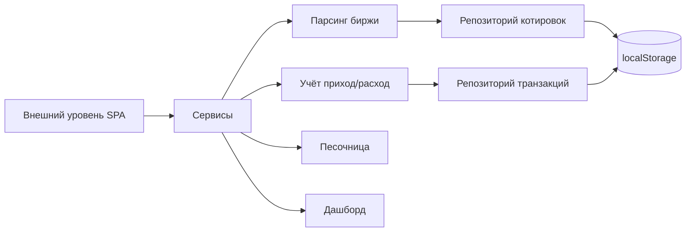

# Golden Clone Assistant — документация проекта

Веб-приложение (SPA, всё в браузере) для учёта и прогнозирования экономики
аккаунта в онлайн-стратегии «Золотой клон». Управляет приходами/расходами по
игровым блокам, принимает HTML-разметку страницы биржи для извлечения цен
ресурсов и позволяет моделировать прибыльность («песочница»).

## Технологический стек

- **React 19** + TypeScript (строгий режим).
- Сборка: **Vite** (dev / build / preview).
- Стили: **Sass** (модули тем, светлая/тёмная).
- Хранилище: `localStorage` (репозитории) с экспортом/импортом резервной копии JSON.
- Роутинг: собственный лёгкий роутер на `history API` — см. [`docs/router.md`](router.md).

## Скрипты

```bash
npm run dev      # dev-сервер
npm run build    # tsc -b && vite build (типы + сборка)
npm run lint     # eslint .
npm run preview  # предпросмотр собранной сборки
```

## Архитектура (вертикальные уровни)

Зависимости направлены строго сверху вниз: **UI → сервисы → данные → ядро**.

```
src/
  core/            # ЯДРО — домен и формулы (не зависит ни от чего)
    domain/        #   types.ts, enums.ts, blockCatalog.ts
    engine/        #   formulas.ts, calculator.ts
  data/            # БАЗЫ ДАННЫХ — хранилище и репозитории
    repositories/  #   repository.interface.ts, localStorageRepository.ts, memory...
    storage/       #   storageManager.ts, schema.ts, backup.ts
  services/        # СЕРВИСЫ — бизнес-логика
    parsing/       #   exchangeParser.ts, parserEngine.ts, parseConfig.ts
    quotes/        #   quoteService.ts
    accounting/    #   accountingService.ts, accountService.ts
    analytics/     #   dashboardService.ts
    sandbox/       #   sandboxService.ts
    accountScope.ts#   активный аккаунт для фильтрации данных
  application/     # ВНЕШНИЙ УРОВЕНЬ — UI, состояние, роутинг
    routing/       #   router.tsx
    state/         #   appStore.tsx (контекст-стор)
    pages/         #   DashboardPage, AccountingPage, SandboxPage, ...
    components/    #   AccountSelector, StatCard
    hooks/         #   useData.ts
    shared/        #   ThemeContext, utils
    styles/        #   main.scss, _themes.scss
  examples/        # образцы разметки (stockTable.html)
  main.tsx         # точка входа
```

## Доменные сущности ([`core/domain`](../src/core/domain))

- **Server** — сервер игры: `metropolis` (Метрополия) / `enclave` (Анклав).
- **User** — пользователь приложения (владелец аккаунтов).
- **Account** — игровой аккаунт: `userId` + `server` + имя персонажа.
- **Block** — игровой экономический блок (Свиноводство, Квасная фабрика и т.п.),
  группируется по `Category`.
- **Transaction** — запись прихода/расхода по блоку; привязана к `accountId`.
- **PriceQuote** — распарсенная цена ресурса биржи: `exchangeId`, `itemId`,
  `itemName`, `price` (мин. цена), `nominalPrice` (номинал), `swapPrice` (лавка),
  `available` (доступно), `unit`, `htmlHash`.
- **SandboxParams / SandboxResult** — вход и результат прогноза прибыльности.
- **Snapshot / CategorySummary / BlockSummary** — агрегаты дашборда.

Каталог блоков [`blockCatalog.ts`](../src/core/domain/blockCatalog.ts) содержит
стартовый набор; пользователь может его дополнять.

## Слои и ответственность

### Ядро (`core`)
Формулы экономики ([`formulas.ts`](../src/core/engine/formulas.ts)) и расчёт
сводок ([`calculator.ts`](../src/core/engine/calculator.ts)):
выручка, затраты, прибыль, маржа, окупаемость, сводки по категориям и блокам.

### Данные (`data`)
- `Repository<T>` — общий интерфейс (`getAll/add/update/remove/clear`).
- `LocalStorageRepository` — персист в `localStorage`.
- `storageManager.ts` — фабрика `DataStore` (users, accounts, blocks,
  transactions, quotes) и `overwriteStore` для импорта копии.
- `schema.ts` — версия схемы, ключи хранилища, ключ активного аккаунта.
- `backup.ts` — экспорт/импорт всего состояния в JSON.

### Сервисы (`services`)
- **AccountService** — управление пользователями и аккаунтами.
- **AccountingService** — приходы/расходы, ограничены активным аккаунтом.
- **QuoteService** — котировки с дедупликацией по `htmlHash`, фильтрация по аккаунту.
- **DashboardService** — сводки и последние операции.
- **SandboxService** — моделирование прибыльности.
- **ExchangeParser / parserEngine** — извлечение ресурсов из HTML биржи.
- **ActiveAccountScope** — хранит выбранный аккаунт; сервисы читают его лениво
  и фильтруют данные, поэтому смена аккаунта не пересоздаёт сервисы.

### Внешний уровень (`application`)
- `appStore.tsx` — React-контекст: сервисы, репозитории, активный аккаунт, счётчик
  изменений (`revision`) для перерендера.
- `AppShell.tsx` — шапка, навигация по вкладкам, селектор аккаунта.
- Страницы: Дашборд, Учёт, Песочница, Импорт данных, Аккаунты, Резервная копия.

## Ключевые сценарии

1. **Аккаунты и серверы.** Пользователь создаёт пользователей и аккаунты на
   серверах. Выбор аккаунта задаёт контекст для всех данных (транзакции,
   котировки). Выбранный аккаунт сохраняется между сессиями.
2. **Импорт биржи.** На странице «Импорт данных» выбирается сервер (по умолчанию —
   сервер текущего аккаунта, иначе Метрополия), вставляется HTML страницы биржи,
   парсер извлекает ресурсы (id, название, номинал, лавка, мин. цена, доступно,
   ед.), есть предпросмотр, сохранение котировок за выбранный аккаунт и выгрузка
   в JSON.
3. **Учёт.** Добавление приходов/расходов по блокам для активного аккаунта;
   отчёты по блокам и категориям; дашборд показывает итоги.
4. **Песочница.** Прогноз прибыльности блока с параметрами и опционально ценой
   из биржи.
5. **Резервная копия.** Экспорт всего состояния в JSON-файл и обратный импорт.

## Потоки данных (упрощённо)



## Идентификация ресурсов биржи

Парсер опирается на **стабильные числовые ID** из разметки (`tr#r_type_N`,
`item_ammount_N`, атрибут `data-price`), а не на слаги имён. Это устойчиво к
переименованию ресурсов. `exchangeId` хранится отдельно; учёт ограничен
аккаунтом, поэтому уникальные товары разных серверов не смешиваются.
Подробнее о стратегии идентификации — в плане разработки.

## Ссылки

- [Роутер](router.md) — описание системы маршрутизации.
- [`plans/golden-clone-assistant-plan.md`](../plans/golden-clone-assistant-plan.md) —
  исходный план архитектуры.