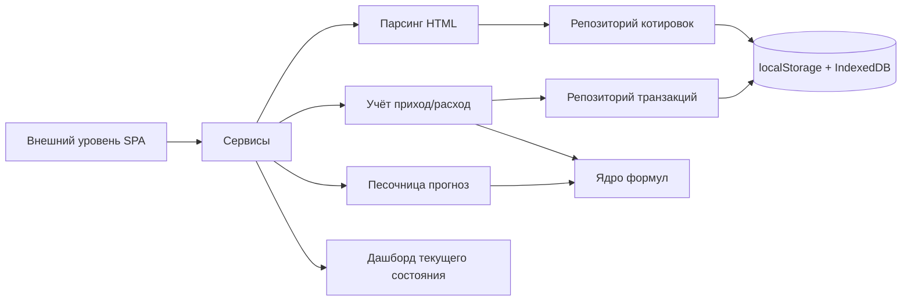

# Golden Clone Assistant — план архитектуры

Веб-приложение (SPA, всё в браузере) для учёта и прогнозирования экономики
аккаунта в онлайн-стратегии «Золотой клон». Управляет приходами/расходами по
игровым блокам, принимает HTML-разметку страниц игры для парсинга цен биржи и
позволяет моделировать прибыльность блоков («песочница»).

## Решения (согласовано с пользователем)

- Хранилище: `localStorage` + `IndexedDB` в браузере, с экспортом/импортом резервной копии JSON.
- Парсинг: ручная вставка HTML в `textarea`, фиксированный пресет правил под страницу биржи.
  Сейчас — заглушка-пресет; точные селекторы настроим позже на реальном образце разметки.
- Функциональные блоки: парсинг разметок, песочница (прогноз), реальные данные (учёт).
- Вертикальные уровни: ядро → базы данных → сервисы → внешний уровень.

## Структура каталога (вертикальные уровни)

```
src/
  core/            # ЯДРО — домен и формулы (не зависит ни от чего)
    domain/        #   types.ts, enums.ts, blockCatalog.ts
    engine/        #   formulas.ts, calculator.ts
  data/            # БАЗЫ ДАННЫХ — хранилище и репозитории
    repositories/  #   repository.interface.ts, adapters (localStorage/IndexedDB/memory)
    storage/       #   storageManager.ts, backup.ts, schema/migrations.ts
  services/        # СЕРВИСЫ — бизнес-логика
    parsing/       #   parserEngine.ts, exchangeParser.ts, parseConfig.ts
    quotes/        #   quoteService.ts
    accounting/    #   accountingService.ts
    sandbox/       #   sandboxService.ts
    analytics/     #   dashboardService.ts
  application/     # ВНЕШНИЙ УРОВЕНЬ — UI, состояние, стили
    pages/         #   DashboardPage, AccountingPage, SandboxPage, DataImportPage
    components/    #   общие UI-компоненты (таблицы, формы, карточки)
    hooks/         #   useRepository, useBackup, useQuotes
    state/         #   appStore.tsx (контекст-стор)
    shared/        #   перенос ThemeContext из 1Application
    styles/        #   main.scss, _themes.scss
  main.tsx
```

Бывшая папка `src/1Application/` реструктурируется в `src/application/`
(тема и стили переносятся внутрь). Зависимости направлены сверху вниз:
UI → сервисы → данные → ядро.

## Функциональные блоки → размещение

| Блок | Суть | Где живёт |
|------|------|-----------|
| Парсинг разметок | Приём HTML, извлечение цен по селекторам через DOMParser | `services/parsing` |
| Реальные данные | Учёт приходов/расходов по блокам, отчёты | `services/accounting` |
| Песочница | Прогноз прибыльности с заданными параметрами | `services/sandbox` |
| Общее ядро формул | Доход/расход/прибыль/маржа/окупаемость | `core/engine` |

## Потоки данных



## Ключевые доменные сущности (core/domain)

- `Category` — группировка блоков (животноводство, заводы/фабрики, госпредприятия,
  недвижимость, рент-инвест, торговля/биржа и т.п.).
- `Block` — игровой экономический блок: `id`, `name`, `category`, базовые параметры.
- `Transaction` — запись прихода/расхода: `id`, `date`, `blockId`, `type`,
  `amount`, `description`, ссылка на котировку.
- `PriceQuote` — распарсенная цена: `itemId`, `itemName`, `price`, `unit`,
  `source`, `timestamp`, `htmlHash` (для дедупликации).
- `SandboxParams` / `SandboxResult` — входные параметры и результат моделирования.
- `Snapshot` — текущее состояние аккаунта (балансы, агрегаты по блокам).

## Формулы (core/engine)

- `calcRevenue(block, qty, price, period)`
- `calcCosts(block, qty, costs)`
- `calcProfit / calcMargin / calcDailyIncome / calcPayback`
- `calculateSnapshot(blocks, transactions)` — сводка реальных данных.

## Механика парсинга (services/parsing)

1. Пользователь вставляет HTML в `DataImportPage`.
2. `parserEngine.parse(html, config)` использует `DOMParser`, применяет
   `config.itemRowSelector` и извлекает имя/цену (`itemNameSelector`,
   `itemPriceSelector`, режим: текст/атрибут/регулярка).
3. `exchangeParser.ts` — пресет правил для биржи (заглушка; селекторы уточняются
   после получения реального образца разметки).
4. Результат → `QuoteService.save()` → репозиторий котировок (с `htmlHash` дедупликацией).

## Слой данных (data)

- `Repository<T>` — общий интерфейс (getAll/add/remove/update).
- Адаптеры: `LocalStorageRepository`, `IndexedDBRepository` (для истории котировок),
  `MemoryRepository` (для песочницы/предпросмотра экспорта).
- `backup.ts` — экспорт всего стейта в JSON и импорт обратно.
- `storageManager.ts` — выбор активного адаптера по типу данных.

## Реализация UI (внешний уровень)

- Навигация по вкладкам (без внешнего роутера на старте): Дашборд / Учёт /
  Песочница / Импорт данных / Резервная копия.
- `appStore.tsx` (React Context) — единый доступ к сервисам и репозиториям.
- Таблицы, формы, карточки, простые CSS-графики (без тяжёлых зависимостей).
- Переиспользование существующей темы (светлая/тёмная) из перенесённого `ThemeContext`.